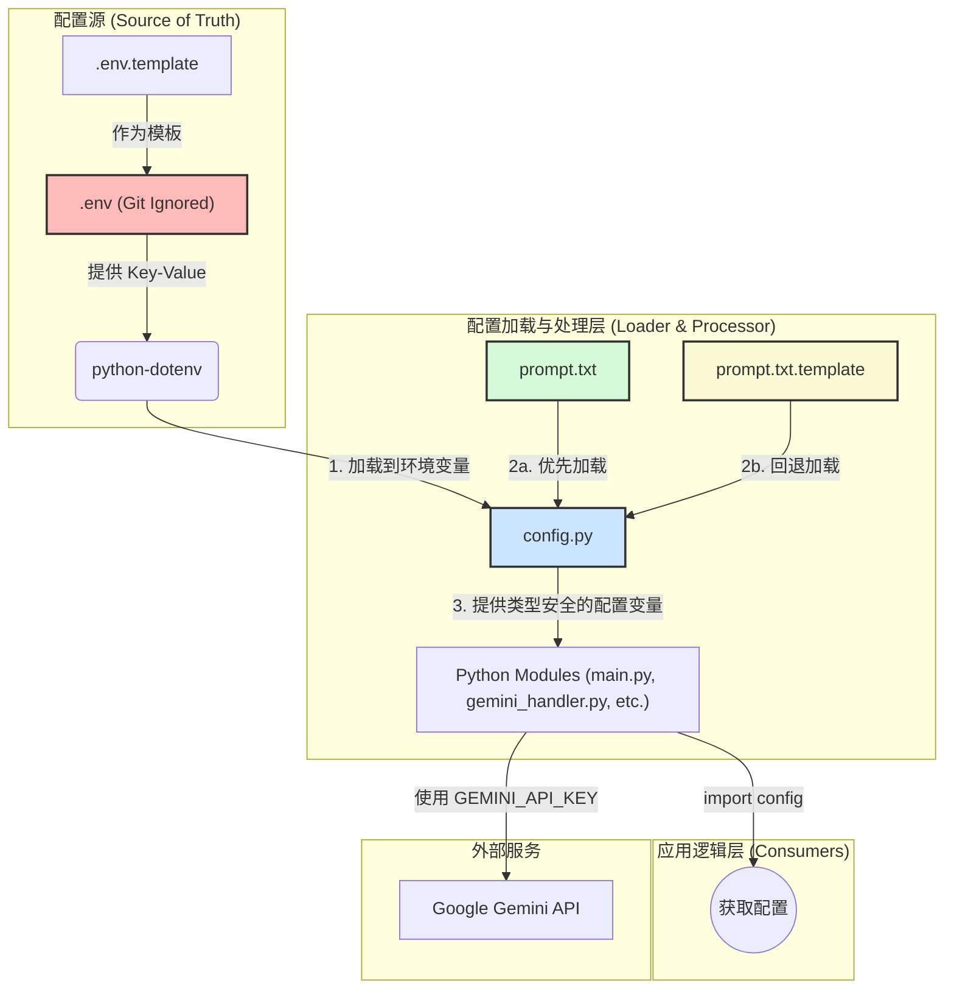

# 微信 Gemini AI 助手机器人 v2.1 

<p align="center">
  <a href="https://github.com/cluic/wxauto"></a>
  <a href="https://ai.google.dev/gemini-api"></a>
  <a href="https://www.python.org/"></a>
  <a href="./LICENSE"></a>
</p>

这是一个基于 Python 的高级微信 AI 助手机器人。它通过 `wxauto` 库与微信桌面客户端进行交互，并集成了 Google 先进的 Gemini 模型。项目最终采纳了 **v2.1 智能意图路由器架构**，能够精准、高效地处理包括函数调用、接地搜索和普通对话在内的各类复杂任务。

---

## 📖 项目目标

本项目的核心理念是**在不影响用户正常使用的前提下，提供一个强大、智能且可高度定制的微信 AI 助手**。它以后台被动监听的模式运行，不会抢占用户的鼠标和键盘，旨在成为一个无缝集成在日常工作流中的高效助理。

---

## ✨ 核心功能

-   **🤖 v2.1 智能意图路由器**:
    -   **动态路径选择**: 能自动分析用户意图，并分发到最优处理路径：**函数调用**、**接地搜索**（联网或知识库）、**混合处理**或**纯对话**。
    -   **高效率**: 避免对简单请求执行不必要的工具调用，显著降低延迟和成本。
    -   **高精度**: 对复杂任务（如“搜索最新财报并总结要点”），能先联网搜索，再将结果注入模型进行精确处理。
-   **🛠️ 强大的工具调用**:
    -   **图片分割**: 可根据指令从图片中抠出指定物体，并以独立文件形式发送。该功能经过特别优化，响应速度更快，效果更佳。
    -   **可扩展**: 架构支持轻松添加更多自定义工具。
-   **🌐 接地搜索 (Grounding)**:
    -   可配置启用 Google 搜索，让 AI 能回答基于最新信息的问题，并提供信息来源。
-   **🖼️ 图片理解**: 支持接收图片并结合上下文进行提问。
-   **🧠 对话历史管理**: 为每个对话维护独立的、可配置轮数的上下文历史，并持久化到本地。
-   **🤫 被动监听与自动交互**:
    -   在后台静默运行，不干扰用户。(在操作微信的时候限于wxauto库, 需要前台模拟点击)
    -   支持私聊和群聊中被`@`时的智能回复。
    -   可配置自动接受新的好友请求。
-   **⚙️ 安全、集中的配置管理**:
    -   **核心原则**: 所有敏感信息（API密钥）和环境参数均通过根目录的 `.env` 文件进行管理，实现了配置与代码的完全分离。
    -   **安全**: 关键的 `.env` 文件已被预先配置在 `.gitignore` 中，杜绝了敏感信息泄露的风险。
    -   **灵活**: 用户可通过编辑简单的文本文件 (`.env`, `prompt.txt`) 来定制应用行为，无需修改任何 Python 代码。

---

## 关键问题解决与优化总结

在整个开发周期中，我们解决了一系列关键的技术挑战：

1.  **解决了函数调用流程挂起问题**:
    *   **问题**: 意图路由器选择函数调用后，应用有时会挂起。
    *   **解决方案**: 通过注入详细的端到端日志，我们定位到 `_execute_function_call_flow_async` 函数在获取到最终回复后未能立即返回。通过修复返回逻辑，确保了执行流的正确性。

2.  **修复了图片分割中的 `AttributeError`**:
    *   **问题**: 模型返回的 base64 数据有时被包裹在列表中，导致 `removeprefix` 方法调用失败。
    *   **解决方案**: 在 `segment_image_async` 函数中增加了 `isinstance()` 类型检查，使代码能够稳健地处理字符串和列表两种格式的返回数据。

3.  **优化了图片分割的性能与效果**:
    *   **问题**: 图片分割任务耗时过长（约4分钟）。
    *   **解决方案**: 根据 Google 官方文档，在调用 Gemini API 时设置了 `thinking_config=types.ThinkingConfig(thinking_budget=0)`，禁用了模型的“思考”过程，显著提升了分割任务的速度和质量。

4.  **建立了稳健的单元测试模式**:
    *   **问题**: 在为 `gemini_handler.py` 编写测试时，遇到了 Pydantic 类型验证失败和 `@patch` 作用域陷阱。
    *   **解决方案**: 确立了“只模拟边界（`genai.Client`），使用真实数据对象”的测试策略，并结合 `importlib.reload()` 确保了测试的隔离性和可靠性。

---

## 项目结构

本项目采纳了分层、解耦的设计思想，确保了代码的可维护性和扩展性。核心架构模式包括“智能意图路由器”和“集中化配置管理”。

### v2.1 - 智能意图路由器架构 (Intent Router Architecture)

*   **核心理念:** 引入一个“意图路由器”作为请求处理的入口点，根据用户查询的意图动态地将请求分发到最优的处理路径（如函数调用、接地搜索、混合处理或纯对话）。
*   **状态:** 已采纳
*   **决策记录:** 详见 `memory-bank/decisionLog.md`
*   **Mermaid 流程图:**
    ```mermaid
    graph TD
        A[用户查询] --> B{意图路由器};
        B -- "FUNCTION_CALL_INTENT" --> C[函数调用流程];
        B -- "GROUNDING_INTENT" --> D[接地流程];
        B -- "HYBRID_INTENT" --> E{混合流程};
        B -- "GENERAL_CONVERSATION_INTENT" --> F[通用对话流程];
        B -- "无法识别" --> F;

        subgraph 混合流程
            E_1[1. 接地获取上下文] --> E_2[2. 增强查询];
            E_2 --> C;
        end

        C --> G[返回最终回复];
        D --> G;
        F --> G;
    ```
*   **关键组件:**
    *   `IntentRouter`: 负责意图分类。可以使用轻量级 LLM 或规则引擎实现。
    *   `FunctionCallingFlow`: 封装了与函数调用相关的 Gemini API 调用和工具执行逻辑。
    *   `GroundingFlow`: 封装了与接地搜索相关的 Gemini API 调用逻辑。
    *   `GeneralConversationFlow`: 处理不涉及任何工具的普通对话。
    *   `ToolExecutor`: 一个辅助模块，负责实际执行本地工具函数。

### 配置与密钥管理流程 v2.0

#### 核心理念
项目采用分层、集中的配置管理模式。所有敏感信息（如 API 密钥）和可变参数（如监听列表）都与核心代码分离，通过环境变量进行管理，以提高安全性、灵活性和可维护性。

#### Mermaid 架构图 (v2.0)



---

## 🚀 快速开始

### 1. 环境要求

-   Python 3.9+
-   Windows 10+
-   微信桌面客户端 (建议 3.9.8+ 版本)

### 2. 安装

首先，克隆或下载本项目到本地。

```bash
git clone https://github.com/yuqie6/wechat-bot.it
cd wechat-bot
```
> 请将 `your-username/your-repo-name` 替换为您自己的 GitHub 仓库地址。

然后，安装已锁定的依赖库版本，确保环境一致性：

```bash
pip install -r requirements.txt
```

### 3. 配置

本项目的配置流程安全、清晰，核心在于 `.env` 文件和 `config.py` 模块的协同工作。

1.  **创建 `.env` 文件**:
    *   将项目根目录下的 `.env.template` 文件复制一份，并重命名为 `.env`。
    *   这个 `.env` 文件是所有配置的**唯一真实来源**，并已在 `.gitignore` 中被忽略，以防泄露密钥。

2.  **编辑 `.env` 文件**:
    *   打开 `.env` 文件，根据里面的注释填入你自己的信息。

3.  **理解工作原理 (可选)**:
    *   应用启动时，`config.py` 会使用 `python-dotenv` 库自动加载 `.env` 文件中的所有值，并将它们设置为**环境变量**。
    *   项目中的其他代码会从 `config.py` 中导入已经处理好、类型正确的配置变量，而不是直接读取 `.env` 文件。

#### **关键配置项说明**

-   `GEMINI_API_KEY`: **[必须]** 你的 Google Gemini API 密钥。
-   `LISTEN_CONTACTS`: **[必须]** 希望机器人回复的好友昵称和群聊名称。**重要：** 如果有多个，请将它们全部写在英文双引号内，并用英文逗号 (`,`) 分隔，例如: `LISTEN_CONTACTS="文件传输助手,好友A,家庭群"`。
-   `GROUP_BOT_NAME`: **[必须]** 机器人在群聊中被`@`时使用的名字。
-   `SYSTEM_PROMPT`: AI 的初始化指令。`config.py` 会优先从 `prompt.txt` 文件加载此项，若文件不存在则回退至 `prompt.txt.template`。
-   `ENABLE_GOOGLE_SEARCH`: 是否允许 AI 进行联网搜索，`True` 或 `False`。
-   `AUTO_ACCEPT_FRIENDS`: 是否自动接受好友请求，`True` 或 `False`。
-   `MAX_HISTORY_TURNS`: 控制上下文记忆的轮数。默认是 `10`。设置为 `0` 可开启“无限记忆”模式（注意成本）。

### 4. 运行

确保你的微信客户端已经登录，然后运行主程序：

```bash
python main.py
```

机器人启动后，会开始在后台被动监听消息。现在，去你配置的联系人聊天窗口里和他/她说句话试试吧！

---

## 🤝 贡献

欢迎对本项目进行贡献！你可以通过提交 Issue 或 Pull Request 的方式参与进来。

## 📄 许可证

本项目基于 [MIT License](./LICENSE) 开源。